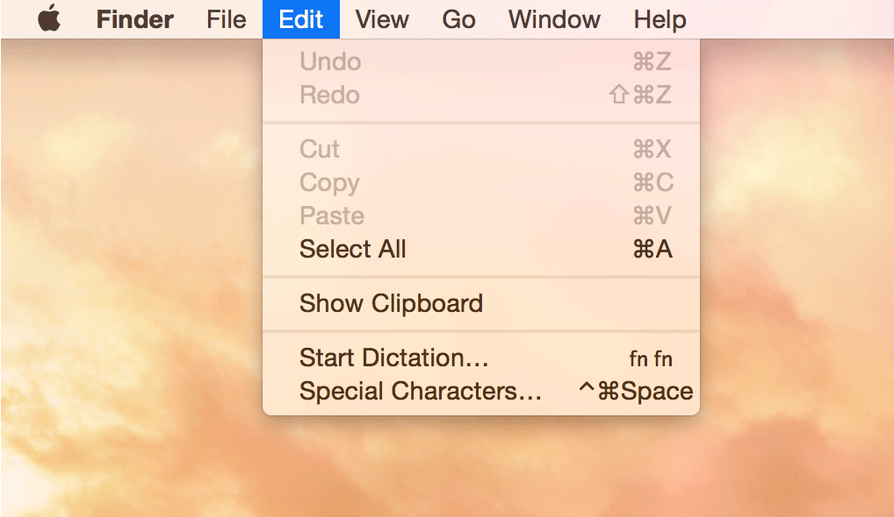

# dark-mode

> Control the macOS dark mode from the command-line

Requires macOS 10.10 or later. macOS 10.13 or earlier needs to download the [Swift runtime support libraries](https://support.apple.com/kb/DL1998).



## Install

###### [Homebrew](http://brew.sh)

```
$ brew install dark-mode
```

###### [npm](https://github.com/sindresorhus/dark-mode-cli)

```
$ npm install --global dark-mode-cli
```

###### Manually

[Download](https://github.com/sindresorhus/dark-mode/releases/latest) the binary and put it in `/usr/local/bin`.

## Usage

```
$ dark-mode --help

  Usage
    $ dark-mode [command]

  Commands
    <none>  Toggle dark mode
    on      Enable dark mode
    off     Disable dark mode
    status  Dark mode status
```

## Build

Run `./build`. The binary can be found at `./bin/dark-mode`.

Building in Xcode works, but it does not export a binary.

## Related

- [node-dark-mode](https://github.com/sindresorhus/node-dark-mode) - Node.js port
- [alfred-dark-mode](https://github.com/sindresorhus/alfred-dark-mode) - Alfred workflow
